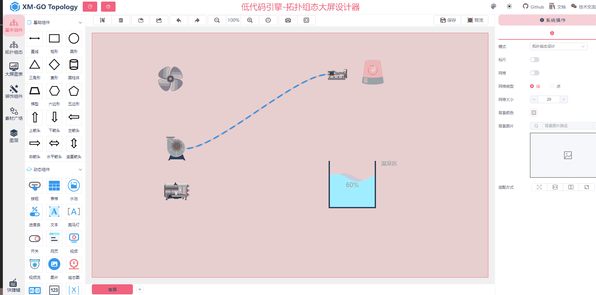
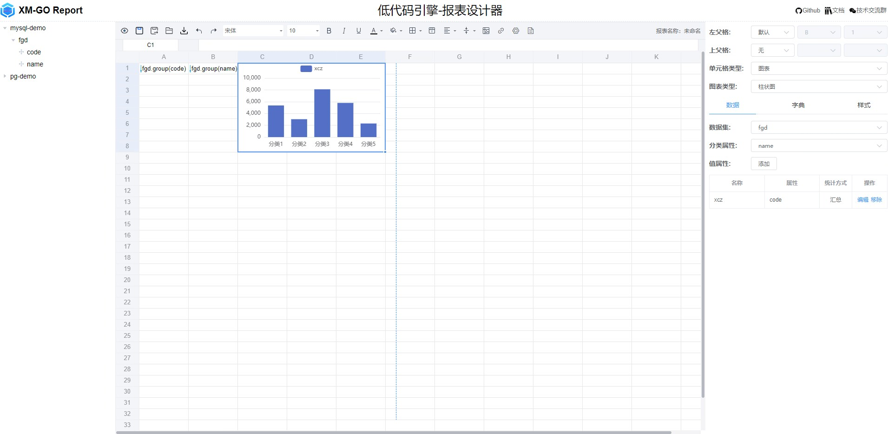
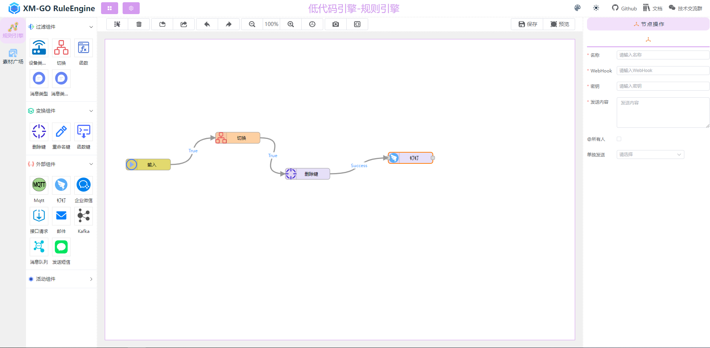
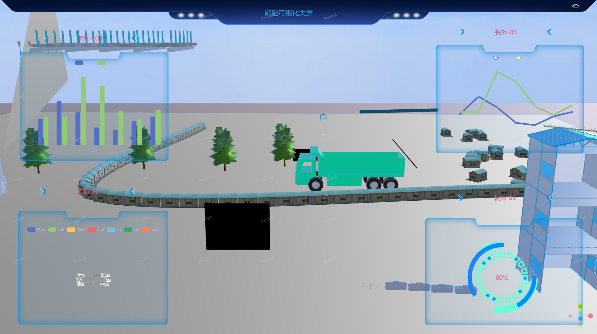

# 组态大屏、规则链、报表设计器

<h3 align="center">物联网低代码引擎-组态大屏、规则链、报表系统</h3>

<h3 align="center">组态大屏、规则链、报表系统，基于 Vue3.0 + TypeScript + vite2 + Element-plus技术完成</h3>

<table>
    <tr>
        <td></td>
        <td></td>
    </tr>
</table>

---

### ⭐️ 有什么功能？

- ✔ **`多数据源`** - _MySQL，Postgresql,Tdengine，MQTT,Wensocket，http等。._
- ✔ **`孪生体绑定`** - _设备孪生体绑定。_
- ✔ **`事件绑定`** - _节点绑定事件，点击事件等，支持打开连接，触发动画，停止动画，关联页面，孪生体操作等。_
- ✔ **`动画管理`** - _绑定动效，可根据数据驱动触发动效，例如报警闪烁，风机旋转等。_
- ✔ **`多画布支持`** - _可设计多个画布，通过事件绑定进行切换。_
- ✔ **`基础组件`** - _基础节点，组态大屏都可使用。_
- ✔ **`图谱组态`** - _拓扑图组件节点，没有的可以通过图片节点上传。_
- ✔ **`大屏图表`** - _包括柱状图，线型图等图表_
- ✔ **`装饰框`** - _装饰框_
- ✔ **`报表节点`** - _根据数据源生成报表。_
- ✔ **`规则链设计`** - _规则链设计，作为物联网数据的链路过滤。_
- ✔ **`在线报表设计`** - _可对设备数据，基础数据进行拖拽生成报表。_

## 案例1

> **开发交流的 `QQ 2417920382` 群中会不定时一起投票未来的功能！**
